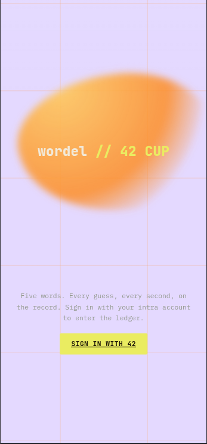
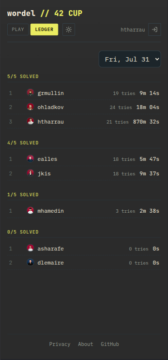
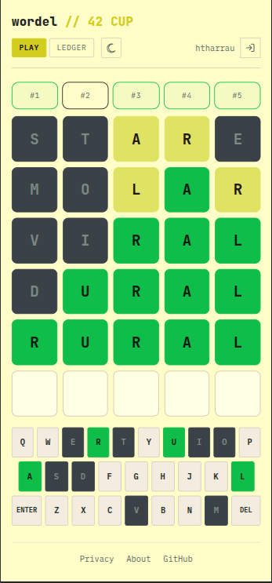

# wordel // 42 Cup





Live app: https://wordel-sepia-nu.vercel.app

wordel // 42 Cup is a wordel-style game built for 42 students during the club immersion day. It lets players sign in with their 42 account, play through the daily word set, and compare results on the leaderboard.

The game is seeded with 5 randomly selected words from the repository word pool in [backend/data/competition-words.txt](backend/data/competition-words.txt). That pool currently contains about 1,849 words. Guess validation uses the wordel allowed-guess list in [backend/data/guesses.txt](backend/data/guesses.txt), which contains about 14,853 entries.

## Stack

- Frontend: React + Vite, deployed on Vercel
- Backend: Fastify.js, deployed on Render
- Database: Supabase
- Authentication: 42 OAuth

## What it does

- Sign in with your 42 account
- Play the current daily draw of 5 words
- Submit only valid wordel guesses
- Track progress and leaderboard results per day
- Keep past draws stored in the database

## How it works

- The backend selects 5 words at random from the competition pool for the active day.
- The answer word never reaches the client.
- The frontend only receives the word metadata and feedback for submitted guesses.
- Leaderboard results are computed from the stored game results in Supabase.

## Caching and latency strategy

- The backend keeps the active Berlin-day draw in an in-process cache, so repeated `/api/game/progress` and `/api/game/start` requests for the same day do not keep reloading the draw from Supabase.
- The public leaderboard now uses a short-lived in-memory cache keyed by draw date, and successful guess submissions invalidate the current day so fresh scores show up quickly.
- The frontend caches each user’s progress in `localStorage`, scoped by login and Berlin date, so the game can render immediately on repeat visits while the latest state is refreshed from the API.
- Both caches are day-scoped, which keeps old draws isolated and avoids serving stale state across midnight resets.
- The overall latency strategy is to keep the hot path small: only metadata and per-letter feedback move across the network, while the heavier draw and progress reads stay local to the app tier when possible.

## Repository layout

```text
backend/
	src/        Fastify API, auth, game logic, and leaderboard routes
	data/       Competition word pool and allowed-guess list
	supabase/   Schema, views, and migration files

frontend/
	src/        React app, UI components, and styles
```

## Local development

See [backend/README.md](backend/README.md) and [frontend/README.md](frontend/README.md) for the setup and deployment details.

## Notes

- The backend is hosted on Render.
- The frontend is hosted on Vercel.
- The database is hosted on Supabase.
- The app is designed for the 42 club immersion day, but it can be reused for other small wordel competitions.

## License

This project is open source under the MIT License. See [LICENSE](LICENSE).